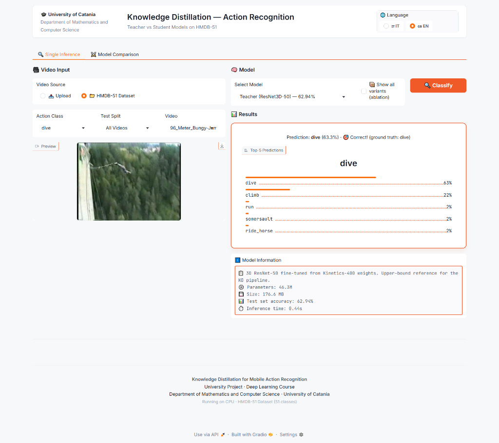
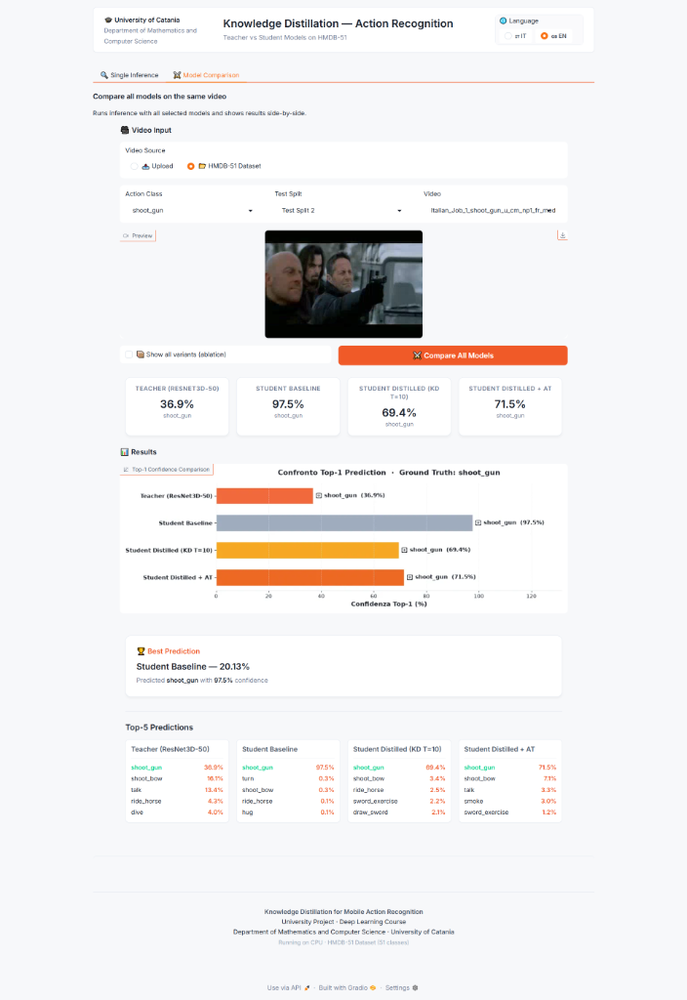
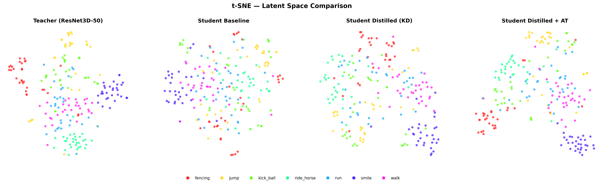
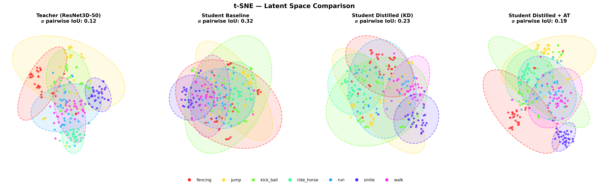

# Knowledge Distillation for Mobile Action Recognition


## 👥 Group and Project Information
- **Group ID**: G39
- **Project ID**: 32

## 📝 Project Description
This repository addresses the high computational cost of video action recognition on mobile devices by compressing a heavy **3D ResNet-50** teacher model into an ultra-lightweight **3D MobileNet** student via **Knowledge Distillation (KD)** on the HMDB-51 dataset. By utilizing logit-matching, temperature ablations, and feature-based attention transfer, the project successfully bridges the student's performance gap while reducing parameter counts by 5–10x. Comprehensive evaluations track the accuracy trade-offs, model size reductions, and inference latency improvements, backed by t-SNE latent space visualizations.

<details>
<summary><b>📂 Click to expand Directory Structure</b></summary>

```text
.
├── data/             # Dataset videos and splits
├── docs/             # Documentation and presentation files
├── experiments/      # YAML configuration files
├── figures/          # Evaluation plots and GUI screenshots
├── runs/             # TensorBoard logs and experiment READMEs
└── src/              # Source code
    ├── bootstrap/    # Application bootstrapping and DI setup
    ├── config/       # Configuration management
    ├── datasets/     # Dataloaders and video transformations
    ├── domain/       # Domain entities and interfaces
    ├── evaluation/   # Testing and metrics computation scripts
    ├── gui/          # Gradio Web Interface and components
    ├── i18n/         # Internationalization (i18n) and translations
    ├── models/       # 3D ResNet and MobileNet architectures
    ├── repositories/ # Data access layer
    ├── services/     # Application services (Inference, Comparison, Video Converter)
    ├── training/     # Training and Knowledge Distillation loops
    ├── utils/        # Utility and helper functions
    └── visualization/# Plotting and t-SNE generation scripts
```
</details>

## 🛠 Technical Reproducibility

### 1. Data and Environment Setup

**Prerequisites:**
You can set up the required environment and install all dependencies using Anaconda.

For systems with an NVIDIA GPU (Recommended):
```bash
git clone https://github.com/SimoneAndreaCilia/Knowledge-Distillation-for-Mobile-Action-Recognition.git
cd Knowledge-Distillation-for-Mobile-Action-Recognition
conda env create -f environment.yml
conda activate dl-project
```

For systems without an NVIDIA GPU (CPU-only):
```bash
git clone https://github.com/SimoneAndreaCilia/Knowledge-Distillation-for-Mobile-Action-Recognition.git
cd Knowledge-Distillation-for-Mobile-Action-Recognition
conda env create -f environment-cpu.yml
conda activate dl-project
```

Alternatively, if you prefer using `pip` without Conda, you can install the dependencies using the provided text files:
```bash
# For GPU
pip install -r requirements.txt

# For CPU-only
pip install -r requirements-cpu.txt
```

**Dataset:**
Download the HMDB51 dataset videos from [Hugging Face](https://huggingface.co/datasets/jili5044/hmdb51). Extract the 51 action class folders directly into `data/hmdb51/` and the train/test splits into `data/hmdb51_splits/`.
*Note: You must download this manually and place it in your local directory.*

### Required files

#### Teacher (3D ResNet-50)
- **`r3d50_K_200ep.pth`** — Kinetics-400 pre-trained weights (Hara et al.)
  - Download from: https://github.com/kenshohara/3D-ResNets-PyTorch/releases
  - Size: ~170 MB.
  - *Note: You must download this manually and place it in your local directory to establish the teacher baseline.*

### 2. Network Training
*Note: The experiments in this project were accelerated using an NVIDIA L40S GPU.*

To reproduce the training runs, use the provided configuration files inside `experiments/configs/`.

**Teacher Baseline Training:**
```bash
python src/training/train_baseline.py --config experiments/configs/teacher.yaml
```

**Student Baseline Training:**
```bash
python src/training/train_baseline.py --config experiments/configs/student_baseline.yaml
```

**Improved Model Training (Knowledge Distillation + Attention Transfer):**
```bash
python src/training/train_distill.py --config experiments/configs/distill_AT.yaml
```

### 3. Evaluation
To reproduce the evaluation metrics, profiling, and generate the latent space visualizations (t-SNE), run the provided evaluation scripts.

```bash
# Generate t-SNE latent space comparison plots
python src/evaluation/evaluate_tsne.py

# Run comprehensive model comparison (Teacher vs Baselines vs Distilled)
python src/evaluation/comparison.py
```

## 🖥️ Graphical User Interface (Gradio)

To provide an interactive and accessible way to test our models, we have integrated a **Gradio web interface**. Gradio allows for rapid creation of intuitive UIs for machine learning applications directly from Python.

Through this interface, users can easily interact with the project:
- **Single Inference**: Select videos from the HMDB-51 dataset or upload custom ones to perform action recognition using any of the available models (Teacher, Student Baseline, Student Distilled, etc.). The interface displays the predicted action, Top-5 confidence scores, and detailed model metadata (parameter count, size in MB, and inference latency).
- **Model Comparison**: Run inference on the same video simultaneously across all selected models. This visualizes a side-by-side comparison of their performance, highlighting how the distilled student models close the gap with the teacher through dynamic confidence bar charts.

To launch the Gradio interface locally, run:

```bash
python -m src.main
```

<details>
<summary><b>🖼️ Click to view Interface Screenshots</b></summary>
<br>

<p align="center">
  <b>Single Inference</b><br>
  
</p>

<p align="center">
  <b>Model Comparison</b><br>
  
</p>

</details>

## 🏆 Quantitative Results

The following table summarizes the performance and efficiency trade-offs between the Teacher model and the various Student models on HMDB-51.

| Model | Parameters (M) | Size (MB) | Top-1 Accuracy (%) |
| :--- | :---: | :---: | :---: |
| **Teacher (ResNet3D-50)** | 46.30 | ~176.6 | 62.94% |
| **Student Baseline** | 2.42 | 9.23 | 20.13% |
| **Student Distilled (KD T=10)** | 2.42 | 9.23 | 29.15% |
| **Student Distilled + AT** | 2.42 | 9.23 | **47.19%** |

As shown above, the combination of Knowledge Distillation and Attention Transfer allows the student model to bridge the performance gap significantly (improving from 20.13% to 47.19%) while requiring ~19x fewer parameters than the Teacher model.

## 📊 Latent Space Analysis (t-SNE)

To intuitively understand the effectiveness of our Knowledge Distillation (KD) and Attention Transfer (AT) approaches, we visualize the feature representations (latent space) of the different models using t-SNE. The visualizations project the high-dimensional features of 7 action classes from the HMDB-51 dataset into a 2D space.

### Standard t-SNE Scatter Plot



This plot shows the raw 2D t-SNE projections for the four main training settings:
1. **Teacher (ResNet3D-50)**: The high-capacity teacher model naturally forms well-separated, distinct clusters for different action classes, demonstrating strong feature discrimination.
2. **Student Baseline**: Trained from scratch, the lightweight student model fails to separate the classes effectively. The data points are heavily mixed and scattered, indicating poor generalization and weak feature representation.
3. **Student Distilled (KD)**: By learning from the teacher's soft targets via standard Knowledge Distillation, the student model begins to form more recognizable clusters. The separation is visibly better than the baseline, though some classes still overlap.
4. **Student Distilled + AT**: Combining KD with Attention Transfer yields the best student representation. The clusters become tighter and better separated, more closely mimicking the structural topology of the teacher's latent space.

### Cluster Overlap Analysis (Pairwise IoU)



To quantitatively evaluate the visual separation, we fit covariance ellipses to each class cluster and calculate the average pairwise Intersection over Union (IoU). A lower IoU indicates less overlap and better class separation.
- **Teacher**: Achieves a low **ø pairwise IoU of 0.12**, confirming highly distinct and separated class boundaries.
- **Student Baseline**: Shows a high **ø pairwise IoU of 0.32**, numerically validating the severe cluster overlap and confusion observed in the standard plot.
- **Student Distilled (KD)**: Reduces the overlap to an **ø pairwise IoU of 0.23**, showing a clear quantitative improvement in feature learning over the baseline.
- **Student Distilled + AT**: Achieves an **ø pairwise IoU of 0.19**, the lowest overlap among the student models. This confirms that Attention Transfer significantly helps the lightweight student architecture learn a more discriminative, teacher-like feature space, reducing class confusion.

## 📚 References
- **Knowledge Distillation**: Hinton, G., Vinyals, O., & Dean, J. (2015). Distilling the Knowledge in a Neural Network.
- **Attention Transfer**: Zagoruyko, S., & Komodakis, N. (2016). Paying More Attention to Attention: Improving the Performance of Convolutional Neural Networks via Attention Transfer.
- **Teacher Weights**: Hara, K., Kataoka, H., & Satoh, Y. (2018). Can Spatiotemporal 3D CNNs Retrace the History of 2D CNNs and ImageNet?
- **Dataset**: Kuehne, H., Jhuang, H., Garrote, E., Poggio, T., & Serre, T. (2011). HMDB: A large video database for human motion recognition.
