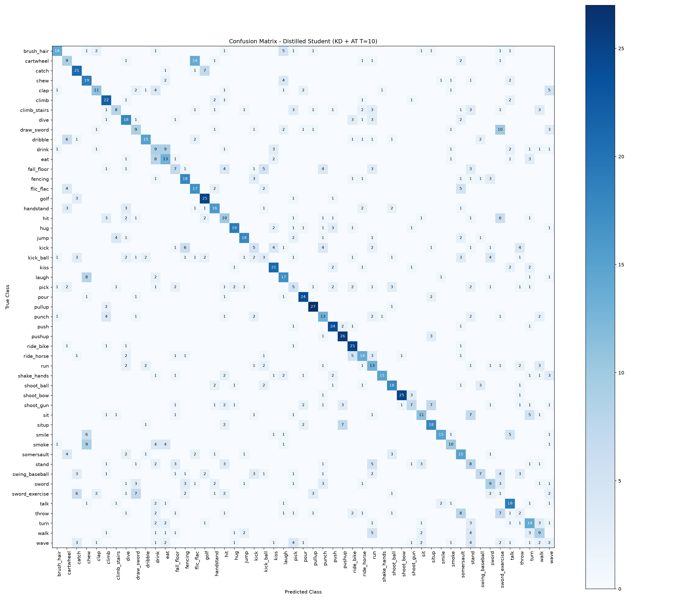

# Knowledge Distillation for Mobile Action Recognition
- **Group ID**: G39
- **Project ID**: 32

---

## Repository Analysis Summary

The repository implements a PyTorch pipeline for compressing a video action recognition model for mobile-oriented inference. It uses HMDB-51 split 1, fine-tunes a high-capacity 3D ResNet-50 teacher, trains a compact 3D MobileNet student, and evaluates knowledge distillation configurations. The authored repository contains dataset loaders, model definitions, training loops, distillation losses, checkpoints, TensorBoard event logs, experiment YAML files, evaluation/visualization code, t-SNE figures, and a Gradio interface for inference and comparison.

The true upper-bound baseline is the Kinetics-400-pretrained ResNet3D-50 teacher. The true lower-bound mobile baseline is the MobileNet3D student trained from scratch with hard labels only. Standard logit distillation improves the student, but the largest improvement is produced by adding Attention Transfer to the T=10 KD setup. The final selected model in the GUI registry is `distilled_AT_T10_seed1234/best_model.pth`; its checkpoint reports 47.06% best validation accuracy at epoch 84. Some README/UI text rounds or reports this as 47.19%, but the checkpoint and TensorBoard evidence support 47.06%.

## Extracted Experimental Evidence

### Dataset and Protocol

| Item | Repository evidence |
| :--- | :--- |
| Dataset | HMDB-51 |
| Classes | 51 class folders and 51 split-1 annotation files |
| Split used | Official HMDB-51 split 1 |
| Train samples | 3,570 |
| Validation/test samples | 1,530 |
| Input clip | 16 RGB frames |
| Spatial size | 112 x 112 |
| Normalization | Kinetics mean `[0.43216, 0.394666, 0.37645]`, std `[0.22803, 0.22145, 0.216989]` |
| Training sampling/augmentation | Uniform temporal segment sampling with random offset; random resize scale 1.0-1.25; random crop; horizontal flip with 0.5 probability |
| Validation preprocessing | Uniform temporal center sampling; resize to approximately 128 x 128; center crop to 112 x 112 |

### Model and Efficiency Evidence

| Model | Parameters | FP32 parameter size | Checkpoint used |
| :--- | ---: | ---: | :--- |
| Teacher ResNet3D-50 | 46,303,475 | 176.63 MB | `checkpoints/teacher/best_model.pth` |
| Student MobileNet3D width 1.0 | 2,419,379 | 9.23 MB | student/KD/AT width-1.0 checkpoints |
| Student MobileNet3D width 1.5 | 5,231,251 | 19.96 MB | `checkpoints/distilled_final_T10_w1.5/best_model.pth` |

### Inference Efficiency on CPU

To simulate edge deployment constraints, we measured the sequential inference latency (batch size 1) and computational complexity on an Intel Core i3 (8th Gen) CPU.

| Model | Parameters | Model Size (MB) | GFLOPs | Inference Latency (ms) | Speedup vs Teacher |
| :--- | ---: | ---: | ---: | ---: | ---: |
| **Teacher** (ResNet3D-50) | 46.30M | 176.63 | 10.14 | ~432.75 ms | 1.0x |
| **Student** (MobileNet3D w=1.5) | 5.23M | 19.96 | 1.51 | ~207.10 ms | 2.1x |
| **Student** (MobileNet3D w=1.0) | 2.42M | 9.23 | 0.76 | ~100.04 ms | **4.3x** |

**Observations & Ablation Justification:**
The baseline `width=1.0` Student model drastically reduces the computational burden compared to the Teacher, requiring ~13x fewer operations (0.76 GFLOPs vs 10.14 GFLOPs) and demonstrating a **4.3x latency speedup** (processing clips in ~100ms instead of ~433ms). 

Furthermore, this profiling justifies our architectural choice over the `width=1.5` variant. As seen in the ablation study, increasing the width multiplier to 1.5 did not improve validation accuracy (29.08% vs 29.15%). The profiling results show that the `width=1.5` model costs twice as much memory (19.96 MB vs 9.23 MB), double the FLOPs, and takes more than twice as long to execute (~207ms vs ~100ms) without any accuracy benefit. Therefore, the `width=1.0` architecture, combined with Attention Transfer (which adds zero inference overhead), is the best choice among the tested configurations for mobile deployment.

### Experiment Results

Checkpoint metadata and TensorBoard event logs agree on the following best validation accuracies.

| Experiment | Main configuration | Best validation accuracy | Best epoch | Final logged validation accuracy | Notes |
| :--- | :--- | ---: | ---: | ---: | :--- |
| Teacher baseline | ResNet3D-50, Kinetics pretrained, fine-tuned | 62.94% | 21 | 40.13% | Upper-bound teacher; later epochs overfit/degrade. |
| Student baseline | MobileNet3D width 1.0, CE only | 20.13% | 62 | 19.09% | Lower-bound mobile baseline; severe overfitting. |
| KD T=1 | T=1, alpha=0.3 | 27.06% | 65 | 26.01% | Improves over CE baseline but transfers little softened structure. |
| KD T=5 | T=5, alpha=0.3 | 28.43% | 47 | 27.65% | Training stopped at epoch 86; better than T=1. |
| KD T=10 | T=10, alpha=0.3 | 29.15% | 65 | 27.71% | Best standard KD temperature run. |
| KD T=20 | T=20, alpha=0.3 | 26.54% | 89 | 25.29% | Extreme smoothing underperforms T=5/T=10. |
| KD T=10 width 1.5 | Wider MobileNet3D, T=10, alpha=0.3 | 29.08% | 71 | 28.30% | More capacity did not improve over width 1.0 T=10. |
| KD + AT beta=10 | T=10, alpha=0.3, AT beta=10 | 40.00% | 72 | 39.67% | Large improvement over logit-only KD. |
| KD + AT beta=100 | T=10, alpha=0.3, AT beta=100 | 45.69% | 88 | 44.31% | Stronger AT improves generalization. |
| KD + AT beta=1000 seed 42 | T=10, alpha=0.3, AT beta=1000 | 46.47% | 91 | 45.75% | Best seed-42 AT run. |
| KD + AT beta=1000 seed 1234 | T=10, alpha=0.3, AT beta=1000 | **47.06%** | 84 | 46.21% | Best checkpoint found and selected by model registry. |

Loss evidence from final logged epochs shows the trade-off introduced by AT. Standard KD T=10 ends with train loss 0.5330 and validation loss 1.5763. AT beta=1000 seed 1234 ends with train loss 31.1979 and validation loss 1.1427 because the weighted attention loss dominates the raw training objective, while validation accuracy improves substantially.

---

## 1. Introduction and Objective

Video action recognition requires learning spatial appearance and temporal motion patterns from clips rather than still images. This makes accurate models computationally expensive, especially when 3D convolutions are used. Such cost is problematic for mobile or edge deployment, where memory, latency, and energy budgets are constrained.

The objective of this project is to reduce the deployment cost of HMDB-51 action recognition by transferring knowledge from a high-capacity 3D ResNet-50 teacher to a lightweight 3D MobileNet student. The project studies whether knowledge distillation can recover part of the accuracy lost when moving from a 46.30M-parameter teacher to a 2.42M-parameter mobile student. The repository evaluates both logit-level knowledge distillation and intermediate feature supervision through Attention Transfer.

## 2. Contribution and Added Value

The project goes beyond simply running an existing model by implementing a complete teacher-student training and evaluation workflow. The codebase includes custom 3D ResNet-50 and 3D MobileNet architectures, HMDB-51 video loading and preprocessing, baseline and distillation training scripts, structured TensorBoard logging, checkpoint management, experiment YAML files, t-SNE visualization scripts, and a Gradio interface for interactive model inference and comparison.

The main methodological contribution is the progression from a hard-label MobileNet3D baseline to logit-level KD and then to Attention Transfer. Standard KD uses a temperature-scaled KL-divergence objective combined with hard-label cross entropy. Attention Transfer adds parameter-free intermediate supervision by matching teacher and student attention maps computed from feature activations. The repository also contains ablations over distillation temperature, student width, AT loss weight, and random seed.

## 3. Data Used

The dataset used is HMDB-51, a 51-class human action recognition benchmark. The repository uses official split 1 annotation files located in `data/hmdb51_splits/`. From those annotations, split 1 contains 3,570 training videos, 1,530 validation/test videos, and 1,666 unused videos. The loader constructs class labels from the 51 directories in `data/hmdb51/`.

Each sample is loaded as a video clip of 16 RGB frames. Frames are selected by uniform temporal segment sampling. During training, the loader samples a random frame inside each temporal segment, resizes the clip by a random scale from 1.0 to 1.25, applies a random 112 x 112 crop, and horizontally flips clips with probability 0.5. During validation, it uses deterministic segment centers, resizes to approximately 128 x 128, and takes a center crop of 112 x 112. Inputs are normalized with Kinetics-400 statistics.

## 4. Methodology and Architecture

The teacher is a 3D ResNet-50 with bottleneck residual blocks and layer configuration `[3, 4, 6, 3]`. Its stem uses a 3D convolution over RGB clips, followed by batch normalization, ReLU, max pooling, four residual stages, adaptive 3D average pooling, dropout, and a 51-way fully connected classifier. The code supports Kinetics-400 pretrained weights from Hara et al.; the HMDB-51 classifier head is randomly initialized. Training uses a two-phase fine-tuning strategy: the backbone is frozen for the first 5 epochs and then unfrozen with a smaller backbone learning rate.

The student is a 3D MobileNet based on MobileNetV2-style inverted residual blocks. Each block expands channels with a 1 x 1 x 1 convolution, applies a depthwise 3 x 3 x 3 convolution, and projects with a linear 1 x 1 x 1 bottleneck. The width-1.0 student has 2,419,379 parameters, about 19.14x fewer than the teacher, and the width-1.5 student has 5,231,251 parameters. The main mobile choices are depthwise separable 3D convolutions, inverted residual connections, ReLU6 activations, channel scaling via width multiplier, and global pooling before the classifier.

The logit distillation loss is:

`L = alpha * CE(student_logits, labels) + (1 - alpha) * T^2 * KL(softmax(teacher_logits / T) || softmax(student_logits / T))`

All KD runs use `alpha=0.3` and label smoothing `0.1`. The tested temperatures are 1, 5, 10, and 20. The best logit-only configuration is T=10 with 29.15% validation accuracy.

Attention Transfer is optional and uses intermediate features. The teacher exposes `layer2` and `layer3`; the student exposes corresponding stage features. Attention maps are computed as channel-wise activation energy, flattened, L2-normalized, interpolated when spatial-temporal dimensions differ, and compared with MSE. The total AT training objective adds `beta * AT_loss` to the KD objective. Tested AT beta values are 10, 100, and 1000.

## 5. Results and Discussion

### Main Quantitative Comparison

| Model | Parameters | Size | Best validation accuracy | Accuracy gap to teacher |
| :--- | ---: | ---: | ---: | ---: |
| Teacher ResNet3D-50 | 46.30M | 176.63 MB | 62.94% | 0.00 pp |
| Student baseline | 2.42M | 9.23 MB | 20.13% | -42.81 pp |
| Student KD T=10 | 2.42M | 9.23 MB | 29.15% | -33.79 pp |
| Student KD + AT beta=1000 seed 1234 | 2.42M | 9.23 MB | **47.06%** | -15.88 pp |

The hard-label student baseline performs poorly compared with the teacher, reaching only 20.13% validation accuracy. TensorBoard logs show that this is not caused by underfitting: the student reaches 99.86% training accuracy by epoch 85 while validation remains near 19.09%. This indicates that the compact model memorizes the small training set without learning sufficiently general spatiotemporal representations.

Logit-level KD provides a clear but limited gain. The best standard KD run is T=10, improving the student from 20.13% to 29.15%, a +9.02 percentage-point increase. T=5 is close at 28.43%, while T=1 and T=20 underperform. This pattern supports the intended role of temperature: moderate-to-high softening reveals useful inter-class structure, but excessive smoothing at T=20 weakens the teacher signal.

The major performance improvement comes from Attention Transfer. With the same width-1.0 student and T=10 KD, AT raises validation accuracy to 40.00% at beta=10, 45.69% at beta=100, 46.47% at beta=1000 with seed 42, and 47.06% at beta=1000 with seed 1234. The improvement is therefore not merely from logit matching; it comes primarily from intermediate attention supervision. The AT runs also reduce validation loss compared with standard KD despite much larger training loss values when beta=1000 is used, because the raw training objective includes a heavily weighted attention term.

### Ablation Summary

| Ablation | Observed effect |
| :--- | :--- |
| Temperature T=1 to T=10 | Accuracy rises from 27.06% to 29.15%, showing benefit from softened teacher distributions. |
| Temperature T=20 | Accuracy falls to 26.54%, consistent with over-smoothed targets. |
| Student width 1.5 | Accuracy is 29.08%, essentially tied with width-1.0 T=10 and not worth the extra parameters in this evidence. |
| AT beta 10 to 1000 | Accuracy increases from 40.00% to 47.06%, but high beta makes training loss dominated by AT. |
| Seed change for AT beta=1000 | Seed 1234 reaches 47.06% versus 46.47% for seed 42, showing the result is broadly reproducible within about 0.6 pp. |

The t-SNE figures in `figures/` provide qualitative representation evidence. The t-SNE results show average pairwise cluster IoU values of 0.12 for the teacher, 0.32 for the student baseline, 0.23 for KD, and 0.19 for KD+AT. These values support the quantitative trend: KD improves feature separation relative to the baseline, and AT produces the most teacher-like student representation among the student models.

### Detailed Evaluation Metrics

To provide a comprehensive evaluation beyond top-1 accuracy, the optimal Distilled Student model (`distilled_AT_T10_seed1234/best_model.pth`) was evaluated across the entire validation set. The detailed class-level predictions, including precision, recall, and F1-score per class, are persisted in `results/classification_report.csv`. 

The aggregated performance metrics demonstrate the model's robustness:
- **Top-1 Accuracy**: 47.06%
- **Top-5 Accuracy**: 76.21%
- **Macro Precision**: 47.75%
- **Macro Recall**: 47.06%
- **Macro F1 Score**: 46.26%

The Top-5 accuracy (76.21%) indicates that while the model struggles to pinpoint the exact class out of 51 options every time, the correct action is present in its top 5 guesses more than three-quarters of the time, which is highly effective for assisted classification systems.

To analyze specific failure cases, a confusion matrix was generated:

<b>Show Confusion Matrix</b>

  
   
  <i>(Saved locally at <code>figures/confusion_matrix.png</code>)</i>

## 6. Conclusion and Limitations

The project successfully demonstrates that knowledge distillation can substantially improve a mobile-sized 3D action recognition model. The MobileNet3D baseline compresses the teacher from 46.30M to 2.42M parameters, reducing FP32 parameter memory from 176.63 MB to 9.23 MB. This compression comes with a severe accuracy drop when trained with hard labels alone, but KD raises validation accuracy to 29.15%, and KD with Attention Transfer raises it to 47.06%.

The best model still remains 15.88 percentage points below the teacher, so the compression-performance trade-off is significant. The experiments also show persistent overfitting: even the improved students reach very high training accuracy while validation accuracy remains much lower. Wider student capacity did not improve results, suggesting that supervision quality and regularization mattered more than simply increasing parameters.

Future work should include multi-split HMDB-51 evaluation, calibration analysis, stronger augmentation, temporal test-time ensembling, quantization, and additional feature-distillation variants such as the implemented but unevaluated hint-learning adapters.

## 7. Additional Information

### 7.1 Contribution Breakdown
**Simone Andrea Cilia**: Built the 3D MobileNet3D model architecture, implemented the PyTorch training pipeline for both the Teacher (ResNet3D-50) and Student (MobileNet3D) models. Designed and implemented the Knowledge Distillation (KD) and Attention Transfer (AT) loss functions. Developed the data loading and augmentation utilities for the HMDB-51 dataset. Conducted the ablation studies and generated the performance evaluation metrics and visualizations.

### 7.2 Use of Artificial Intelligence

AI-based tools were used as auxiliary support throughout the project. Gemini assisted during the implementation phase, particularly for the development of the model architectures and training procedures. Claude was used during the experimental analysis phase to review results, suggest possible code improvements, and provide feedback on ablation strategies.

The AI tools were used only as support instruments. The final design choices, experiments, validation of the implementation, interpretation of the results, and responsibility for the submitted work were carried out by the project author.